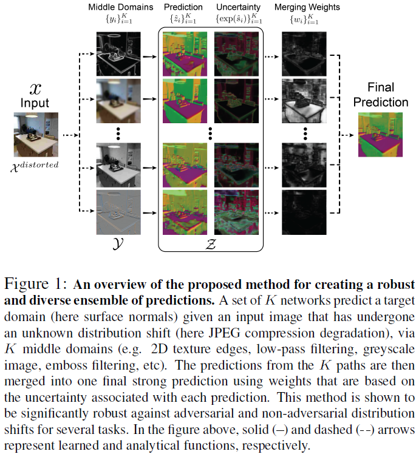
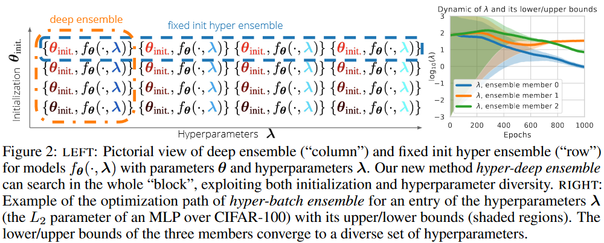
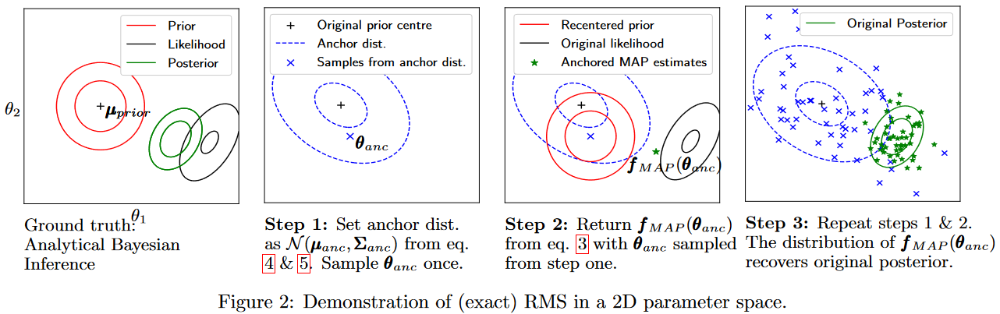

### Template for a Flash Card
  - 1) What did the authors try to accomplish?
  - 2) What were the key elements of the approach?
  - 3) What can I use myself?
  - 4) What other references do I want to follow?

Some concepts : 
 - The lottery ticket hypothesis:
 - Calibration Error
 - mixup regularitation::

## 2023
 - **[Agree to Disagree: Diversity through Disagreement for Better Transferability (D-BAT)](https://openreview.net/forum?id=K7CbYQbyYhY) (ICLR 2023)**
   - **1) What did the authors try to accomplish?**: 
     - Propose an new training approach to promote diversity inside the Deep Ensemble structure called **D-BAT** (**Diversity-By-disAgreement Training**). The core idea is for the models, to learn a diverse set of features, which still allows the subnetwork to have the same prediction (agree) on sampled that have been seen during training, but disagree on the OOD samples (Data distribution shift).
   - **2) What were the key elements of the approach?**:  
     
     - Promote the networks to learn features that a diverse from each other(Not relying on the same familty of featreus e.g., one model would learn shape cues, while another texture cues.).
     - Leads the model to agree on the samples from the training data, but hopefully disagree on the OOD samples.
     - The proposed Loss (Look deeper into it). (But seems to also rely on an OOD dataset ?  Not sure need further reading on this aspect)
      
   - **3) What can I use myself?**:
     - The training strategy **D-BAT**
   - **4) What other references do I want to follow?**: 
     - Simplicity bias: Leads the model to learn and use simple representations.
     - Groupe theory : 

 - **[Packed-Ensembles](https://openreview.net/forum?id=XXTyv1zD9zD) (ICLR 2023)**
   - **1) What did the authors try to accomplish?**: Make Ensemble more memory and inference efficient [Pytorch implementation](https://github.com/ENSTA-U2IS/torch-uncertainty) by proposing Packed-Ensembles(which should be a general view of ensembles) while maintaining near Deep-Ensemble performance.
   - **2) What were the key elements of the approach?**:  
     
     
     - Create an ensemble of "small" NNs in a single NN using grouped convolutions. The parameters between the different sub-NNs are not shared (this is desired in DE, as it allows covering multiple local minimums better).
     - The predictive uncertainty quantification is close DE, while allowing for faster training and inference times. (They achieve SOTA performance on DE benchmarks)
     - When creating the subnetworks, consider the following hyperparameters, $\alpha$, a coefficient to "compensate" the number of parameters in the sub. NN, $\gamma$ the number of groups in the group convolution, and lastly $M$ the number of sub. NN.
   - **3) What can I use myself?**:
     - Packed Ensemble (hence grouped convolution) as *80% of the parameters in NN are not needed (find reference again in the paper)*
   - **4) What other references do I want to follow?**:
     - Important consider section 3.2 Computation Cost of the paper. On how to chose some hyperparameters. (Also at the end of this page, the authors present an alternative for the first rearrange operation)
     - ResNeXt
     - Take also a look at [ConvNext](https://github.com/open-mmlab/mmdetection/tree/main/configs/convnext)

## 2022
- **[Deep Ensembles Work, But Are They Necessary?](https://openreview.net/forum?id=wg_kD_nyAF) (NeurIPS 2022)**
   - *Notes from the reviewers*: Seems that the  experimental setting has some caveats in it... Careful handling this paper, as the reviewing process for this one was difficult...
   - **1) What did the authors try to accomplish?**
     - Compare a Deep Ensemble against a larger NN on the uncertainty quantification/robustness against OOD and prediction capabilities.
     - Hence is there an advantage to Deep Ensemble against a slightly Larger model? 
   - **2) What were the key elements of the approach?**
     - Evaluate empirically Deep Ensemble against Larger NNs
   - **3) What can I use myself?**
     - Nothing ?
   - **4) What other references do I want to follow?**
     - On power laws of Deep Ensembles [NeurIPS 2020]
     - When and how to build CNN ensembles [ICLR 2020]

 - **[Prune and Tune Ensembles: Low-Cost Ensemble Learning With Sparse Independent Subnetworks (PAT Ensemble)](https://arxiv.org/pdf/2202.11782.pdf) (AAAI 2022)**:
   - **1) What did the authors try to accomplish?**
     - Reduce computational costs (Especially for training time) (Low cost Ensemble), while still obtaining a robust ensemble and efficient ensemble.
   - **2) What were the key elements of the approach?**
     - i) Train a parent (Large) DNN (That is trained on the datasets of interest). ii)Create children $M$ NN based on the parent DNN by using pruning the parent DNN $M$ different ways. iii) Fine-tune the children networks on a small number of epochs only.
       
     - The authors make sure that every child network convergence to a unique local minima(how to they ensure that?) after the fine-tuning. (Diversity in DE is very important. Kinda similar to monte carlo dropout with the idea to retrain the NN afterwards)
       
   - **3) What can I use myself?**
     - The approach to generate a chil networks/ training an ensemble with a fast and low cost effort.
   - **4) What other references do I want to follow?**
     - Pseudo-Ensembles, Temporal-Ensembles, Evolutionary-Ensembles.
     - Anti-random pruning.
     - One-Cycle Tuning. 
     - Loss Landscape visualization.
- **[FiLM-Ensemble: Probabilistic Deep Learning via Feature-wise Linear Modulation](https://openreview.net/forum?id=wg_kD_nyAF) (NeurIPS 2022)**
   - **1) What did the authors try to accomplish?**
     - The authors create an implicit Deep Ensemble approach by training Feature-wise Linear Modulation (FiLM) "layers" (conditional batchnorm), basically replace BatchNorm found in NN with those modules. 
   - **2) What were the key elements of the approach?** (No visual explanation (i.e., figure) in the paper)
     - Here the ensembles share the weights of the backbone, but the FiLM modules add the diversity.
   - **3) What can I use myself?**
     - The FiLM layer concept
   - **4) What other references do I want to follow?**
     - Snapshot ensembles by Huang et al. 2017
     - Temperature Scaling by Guo et al. 2017
- **[Diverse Lottery Tickets Boost Ensemble from a Single Pretrained Model](https://aclanthology.org/2022.bigscience-1.4/) (ACL Anthology 2022)** [Video](https://aclanthology.org/2022.bigscience-1.4.mp4)
  - **Note**: I'm probably not gonna follow the ideas of that paper as the results are mitigated..., but since I read it a little...
   - **1) What did the authors try to accomplish?**
     - Make the ensembles more diverse, by fine-tuning sub-networks after pruning them from the same-backbone network
   - **2) What were the key elements of the approach?**
     - Pruning and Fine-tuning
   - **3) What can I use myself?**
     - Nothing
   - **4) What other references do I want to follow?**
     - None
## 2021
 - **[Robustness via Cross-Domain Ensembles](https://crossdomain-ensembles.epfl.ch/) (ICCV 2021)** [Video](https://www.youtube.com/watch?v=YWKVdn3kLp0):
   - **1) What did the authors try to accomplish?**:
     - Want to add robustness to their predictions by leveraging "middle domains".
   - **2) What were the key elements of the approach?**:  
       
     - From the input image, extract middle domains. 
     - Push the middle domains through the NN, and obtain a mean and a variance (Based on the LLH of the Laplacian) during training.
     - Use the uncertainty to weight the predictions of each middle domain (passed through the same NN I think), to obtain a more robust prediction. Uncertainty is quantified on pixel-level.
     - Calibrate the NN with further training, using the uncertainty, with a calibration Sigma training.
    - **3) What can I use myself?**:
      - The calibration principle
      - Using the middle domain as inspiration when employing test time data augmentation.
      - The lossm where a second head would estimate the uncertainty.
    - **4) What other references do I want to follow?**:  

 - **[Masksembles](https://openaccess.thecvf.com/content/CVPR2021/html/Durasov_Masksembles_for_Uncertainty_Estimation_CVPR_2021_paper.html) (CVPR 2021)** [Video](https://www.youtube.com/watch?v=YWKVdn3kLp0):
   - **1) What did the authors try to accomplish?**:
      - Introduce a structured approach for dropping model parameters (versus MC Dropout, which is random).
      - Acts as a continuum between single models, deep-ensemble and MC dropout.
   - **2) What were the key elements of the approach?**:  
     
      - 3 parameters to look at when generating masks:
        - N: Number of masks
        - M: Number of ones in each mask
      - S: Amount of overlap between the masks (Similar to IoU between the generated masks and applying a threshold ? Seems to me in 3.4.)
      - Important: Don't use any number for N,M,S as this implies that the network has to be adapted each time you change N,M,S. Instead, please make sure you have SxM equal to the original amount of channels as in the original NN.
      - Complete overlap leads to a single model.
      - Allowing a fair amount of overlap between the model's weights leads to MC dropout.
      - Avoiding mask overlaps leads to a Deep Ensemble method.
    - **3) What can I use myself?**:
      - The mask generation scheme
    - **4) What other references do I want to follow?**:
      - Packed Ensemble (hence grouped convolution) as *80% of the parameters in NN are not needed (find reference again in the paper)*

 - **[MIMO](https://openreview.net/forum?id=OGg9XnKxFAH) (ICLR 2021)**
    - **1) What did the authors try to accomplish?**: 
      - Use Deep Ensemble of sub-networks for prediction with no overhead on the processing time (memory too). Hence only one forward pass for the prediction, and the uncertainty.  
    - **2) What were the key elements of the approach?**:  
     
      - Create diverse subnetworks (we want diversity of the models in the Deep Ensemble to cover more distant local minimas) inside a bigger network (Also NN are heavily overparameterized, so we can cut approx 80% of the parameters down [find ref in paper]).
      - Inference : Use multiple input and predict multiple outputs. Actually for each subnetwork M, use the same input, but predict M different $\hat{y}$. Take the mean and std to get prediction and uncertainty. (Simple)
      - Training: To ensure that the subnetworks are diverse, during training, train the subnetwork like you would a typicall NN. Don't give them the same images in the batch, as this would lead to the same model.... We want the network to share features, hence the training process is important. (Deeper Look)
    - **3) What can I use myself?**:
      - Creating subnework and the training regiment proposed to obtain diverse subnetworks. (Use in combination with Packed Ensemble?)
    - **4) What other references do I want to follow?**:
      - None

 - **[Uncertainty Quantification and Deep Ensemble](https://openreview.net/forum?id=wg_kD_nyAF) (NeurIPS 2021)**
    - **1) What did the authors try to accomplish?**: 
      - That Deep Ensemble don't necessarily lead to better calibration properties.
    - **2) What were the key elements of the approach?**:  
      - Study the impact of temperature scaling, mixup during training and deep ensemble.
      - Deep ensemble when using small datasets does not lead to better performance (I suppose the models where not enough diverse)
    - **3) What can I use myself?**:
      - Nothing
    - **4) What other references do I want to follow?**:
      - None
## 2020
 - **[Batch Ensemble](https://openreview.net/forum?id=Sklf1yrYDr) (ICLR 2020)**:
   - **1) What did the authors try to accomplish?**:
      - Instead of using multiple models, use one model (i.e., the weights $W$) to generate an ensemble of models. 
   - **2) What were the key elements of the approach?**:  
    
     - To generate the new weights of the model, multiply the weights with a generated mask $F_{i} = s_{i}r_{i}^T$ so that the new weights are $W_{i} = W \circ F_{i}$. Here, $s_{i}$,$r_{i}$ are learnable parameters during training.
     - Hence they also don't need to store the masks $F_{i:N}$ (Similar to MC Dropout, in my opinion) but only the vectors that generate them, which takes less memory.
     - The efficiency comes from the matrix multiplication/vectorization, where all the models can be passed in parallel for a prediction, and they all use the same "backbone model" to generate the ensemble methods.
    - **3) What can I use myself?**:
      - Read again
    - **4) What other references do I want to follow?**:
      - Read again
  - **[Hyperparameter Ensembles for Robustness and Uncertainty Quantification](https://proceedings.neurips.cc/paper/2020/hash/481fbfa59da2581098e841b7afc122f1-Abstract.html) (NeurIPS 2020)**:   
    - **1) What did the authors try to accomplish?**:
      - Propose Hyper-Deep Ensemble.
      - Design ensembles not only by re-training the NN with different initialization and batches (to promote diversity) but also by modifying the hyper-parameters of every NN in the Deep Ensemble.
    - **2) What were the key elements of the approach?**:  
     
      - Builds on batch ensembles.
      - Add diversity to the DE, by using different weights but also hyperparameters (Number of layers, activation functions ??) (they combine random search and greedy selection to find the hyper-parameters)
    - **3) What can I use myself?**:
      - The idea to add diversity also on the hyper-parameters of the NNs composing the DE.
    - **4) What other references do I want to follow?**:
      - Cyclical learning rate.
  
  - **[Uncertainty in Neural Networks: Approximately Bayesian Ensembling](https://arxiv.org/abs/1810.05546) (AISTATS 2020)** [**Video**](https://www.youtube.com/watch?v=eBKqvgecRjc): 
    - **1) What did the authors try to accomplish?**:
      - Use Deep Ensemble as an approximation to Bayesian Neural Networks
    - **2) What were the key elements of the approach?**:  
     
      - Use randomized MAP sampling (RMS), where they also adapt the loss for each NN in the DE. A regularization term is added, but has random *error?* for each unique NN.
      - Apply it to classification when RMS is apply on the parameter space!, which is nice for my use case. But careful need a normal distribution on the likelihood and prior assumption to recover the true posterior distribution.
      - Approximate the posterior but is complicated, need more read on the paper if I want to use it.
    - **3) What can I use myself?**:
      - Adapt my DE an approximated Bayesian Neural Network, and perhaps leverage the GP principle?
      - So basically RMS to model the *posterior predictive uncertainty?*
    - **4) What other references do I want to follow?**:
      - RMS in this paper
      - Hamiltonian MC
  
