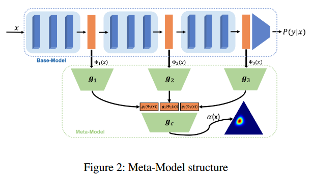
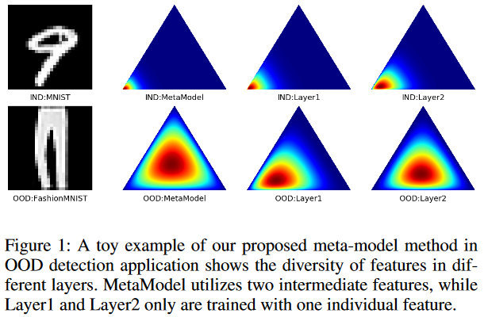

### Template for a Flash Card
  - 1) What did the authors try to accomplish?
  - 2) What were the key elements of the approach?
  - 3) What can I use myself?
  - 4) What other references do I want to follow?

Some concepts: 

## 2023
 - **[Name](Link to openrievew or arxiv) (CONF YYYY)**
   - **1) What did the authors try to accomplish?**: 
   - **2) What were the key elements of the approach?**:  
   - **3) What can I use myself?**:
   - **4) What other references do I want to follow?**: 

## 2022
 - **[Post-hoc Uncertainty Learning using a Dirichlet Meta-Model](https://openreview.net/forum?id=M9vtjDX07Bv&referrer=%5Bthe%20profile%20of%20Maohao%20Shen%5D(%2Fprofile%3Fid%3D~Maohao_Shen1))) (AAAI 2022)**
   - **1) What did the authors try to accomplish?**: 
     - Quantify the uncertainty post-hoc (after training the Backbone Neural Network) without using new training data or training the NN from scratch.
     - Estimate epistemic and aleatoric uncertainty
   - **2) What were the key elements of the approach?**:  
       
       
     - Propose an auxiliary model to learn the uncertainty of the "main model", named meta-model (Is Based on the Baesian/Dirichlet meta-model prior ??)
   - **3) What can I use myself?**:
     - Meta/Auxiliary model to estimate the uncertainty
   - **4) What other references do I want to follow?**: 
     - Intrinsic and extrinsic uncertainty estimation approaches (DE is intrinsic).
     - Homoscedastic/Heteroscedastic 
     - Jackknife [Wikipedia](https://fr.wikipedia.org/wiki/Jackknife)
     - DEUP (Jain et al. 2020??)
     - LULA (Laplace Approximation Kristiadi et al. 2021)
     - ELBO Loss

## 2021
 - **[Name](Link to openrievew or arxiv) (CONF YYYY)**
   - **1) What did the authors try to accomplish?**: 
   - **2) What were the key elements of the approach?**:  
   - **3) What can I use myself?**:
   - **4) What other references do I want to follow?**: 

## 2020
 - **[Name](Link to openrievew or arxiv) (CONF YYYY)**
   - **1) What did the authors try to accomplish?**: 
   - **2) What were the key elements of the approach?**:  
   - **3) What can I use myself?**:
   - **4) What other references do I want to follow?**: 