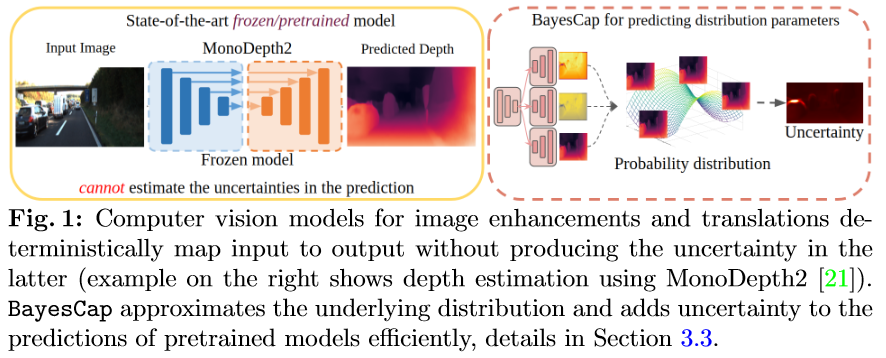
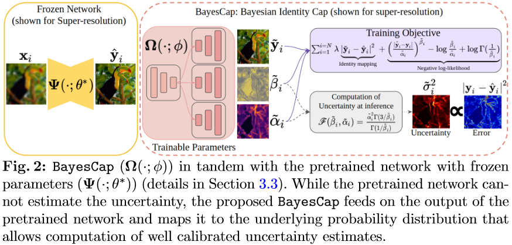

### Template for a Flash Card
  - 1) What did the authors try to accomplish?
  - 2) What were the key elements of the approach?
  - 3) What can I use myself?
  - 4) What other references do I want to follow?

Some concepts: 

## 2023
 - **[Post-hoc Uncertainty Learning using a Dirichlet Meta-Model](https://openreview.net/forum?id=M9vtjDX07Bv&referrer=%5Bthe%20profile%20of%20Maohao%20Shen%5D(%2Fprofile%3Fid%3D~Maohao_Shen1))) (AAAI 2023)**
   - **1) What did the authors try to accomplish?**: 
     - Quantify the uncertainty post-hoc (after training the Backbone Neural Network) without using new training data or training the NN from scratch.
     - Estimate epistemic and aleatoric uncertainty
   - **2) What were the key elements of the approach?**:  
       
       
     - Propose an auxiliary model to learn the uncertainty of the "main model", named meta-model (Is Based on the Baesian/Dirichlet meta-model prior ??)
   - **3) What can I use myself?**:
     - Meta/Auxiliary model to estimate the uncertainty
   - **4) What other references do I want to follow?**: 
     - Intrinsic and extrinsic uncertainty estimation approaches (DE is intrinsic).
     - Homoscedastic/Heteroscedastic 
     - Jackknife [Wikipedia](https://fr.wikipedia.org/wiki/Jackknife)
     - DEUP (Jain et al. 2020??)
     - LULA (Laplace Approximation Kristiadi et al. 2021)
     - ELBO Loss
  
 - **[Name](Link to openrievew or arxiv) (CONF YYYY)**
   - **1) What did the authors try to accomplish?**: 
   - **2) What were the key elements of the approach?**:  
   - **3) What can I use myself?**:
   - **4) What other references do I want to follow?**: 

## 2022
 - **[Gradient-based Uncertainty for Monocular Depth Estimation](<https://arxiv.org/abs/2208.02005>) (ECCV 2022)**
   - **1) What did the authors try to accomplish?**:
     - UQ on pixel level for Depth Estimation NN, on a post-hoc manner, meaning to retraining the NN. Emphasize on the post-hoc process. A train-free solution !
   - **2) What were the key elements of the approach?**: 
     
     - Predict two depth estimation for the same input image. One is not flipped, while the other is horizontally flipped (makes sense for horizontally flipping as the CNN are translation invariant not rotation invariant, so using a vertical flip or some other form on transformation would just add errors).
     - Use an Auxiliary Loss which computes the difference between the two outputs (naturally the one flipped is flipped back).
     - Propagate the gradient (but don't train) to an intermediate layer of the NN and use the gradient (up scale it to the original output) to obtain UQ on pixel level. I don't see the mathematically foundation behind this? Perhaps in the paper explained.
     - They achieve SOTA performance, but by looking on the pixel level UQ, it seems to be just slightly better then previous methods(i.e., DE, MCD), cf figure below.
       
   - **3) What can I use myself?**:
     - As this is a specific solution for Depth Estimations, I can't use the flipped concept, but perhaps some idea might emerge from this.
   - **4) What other references do I want to follow?**: 
     - Bootstrapped ensembles
     - Evaluating scalable bayesian deep learning methods for robust computer vision (CVPRW 2020).
     - 
 - **[ayesCap: Bayesian Identity Cap for Calibrated Uncertainty in Frozen Neural Networks](<https://arxiv.org/abs/2207.06873>) (ECCV 2022)**
   - There is also a blog post about their method [Demo](https://www.eml-unitue.de/publication/BayesCap)
   - **1) What did the authors try to accomplish?**: 
     - Develope a post-hoc solution for UQ. The idea is to not train BNN as to difficule and instead, rely on a SOTA Deterministic (instead of Probabilistic) NN as backbone, and add the probabilistic aspect as an extension (plus-and-play modulde) to the backbone and only retrain the section, and keep the backbone NN frozen. Seems to yield good results for calibration too.
   - **2) What were the key elements of the approach?**:  
       
        
     - The method should be agnistic of the task and model, although they only provide some insight for regression tasks, not discrete task.
   - **3) What can I use myself?**:
     - Expand on their work for the classification task ?
     - Aleatoric uncertainty more present than epistemic uncertainty as the vision NN are trained with large datasets.
     - They package: BayesCap, or inspire my self. Need to re-read the method section for more details.
   - **4) What other references do I want to follow?**: 
     - [Well-Calibrated Regression Uncertainty in Medical Imaging with Deep Learning](https://proceedings.mlr.press/v121/laves20a.html)
     - Laplace approximation as a post-hoc manner to UQ.
     - Bayesian auto-encoder.
     - Test time data augmentation.
     - Heteroscedastic: En statistique, l'on parle d'hétéroscédasticité lorsque les variances des résidus des variables examinées sont différentes. Le mot provient du grec, composé du préfixe hétéro- (« autre »), et de skedasê (« dissipation»).
## 2021
 - **[Name](Link to openrievew or arxiv) (CONF YYYY)**
   - **1) What did the authors try to accomplish?**: 
   - **2) What were the key elements of the approach?**:  
   - **3) What can I use myself?**:
   - **4) What other references do I want to follow?**: 

## 2020
 - **[Name](Link to openrievew or arxiv) (CONF YYYY)**
   - **1) What did the authors try to accomplish?**: 
   - **2) What were the key elements of the approach?**:  
   - **3) What can I use myself?**:
   - **4) What other references do I want to follow?**: 